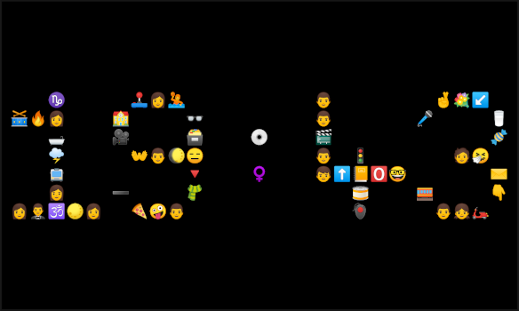

# Emoji Clock

Welcome to Emoji Clock!



This is Johannes Löhnn's submission for the Flutter clock challenge. For more information, see:

* [flutter.dev/clock](https://flutter.dev/clock) for how to get started, submission requirements, contest rules, and FAQs.

* [live demo](https://maryx.github.io/flutter_clock) with Flutter for Web!

Best experience will be running the clock in Android, as it was developed using an Android device.

### How tu run

In terminal, navigate into the directory digital_clock

```
$ cd digital_clock
```

Then make sure to initialize the project
```
$ flutter create . 
```

After that, you shuold be able to just build and run it
```
$ flutter run
```